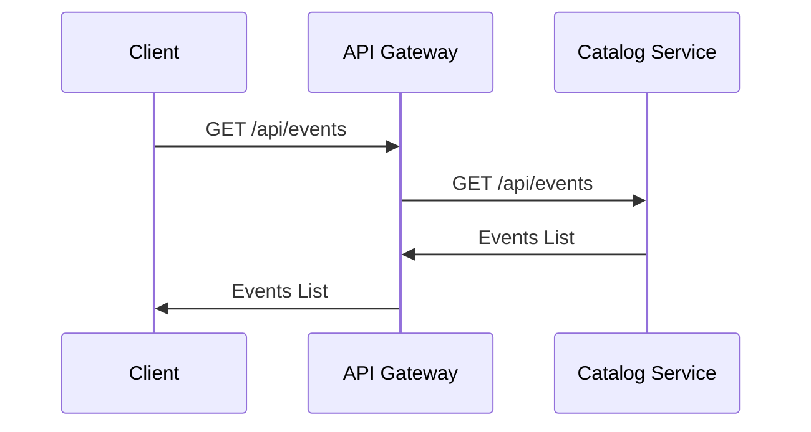
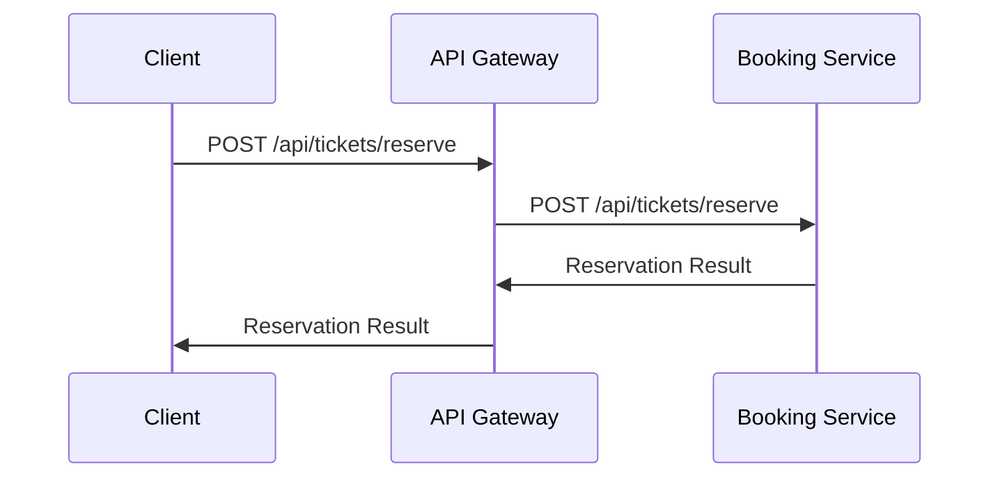
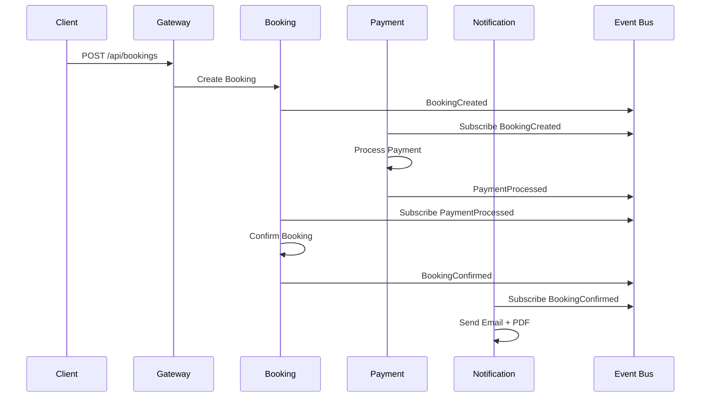

# ADR-004: Inter-Service Communication Strategy

## Status
Accepted

## Date
2025-11-26

## Context
In a microservices architecture, communication between services is critical for:

- **Operation coordination**: A reservation requires validating event, creating booking and processing payment
- **Consistency**: Maintaining coherence between distributed data
- **Performance**: Minimizing latency in critical operations
- **Resilience**: Tolerance to individual service failures
- **Scalability**: Avoiding communication bottlenecks

Patterns to consider:
- Synchronous communication (HTTP/gRPC)
- Asynchronous communication (Events/Messages)
- Orchestration vs Choreography
- Request/Response vs Publish/Subscribe

## Decision
We adopt a **hybrid approach** to communication:

### 1. Synchronous Communication: API Gateway + HTTP
**For**: Real-time queries and immediate validations
```
Client → API Gateway → Microservice
```

### 2. Asynchronous Communication: Event-Driven Architecture
**For**: Business operations and eventual consistency
```
Service A → Event Bus → Service B, C, D
```

### 3. Saga Pattern for Distributed Transactions
**For**: Complex operations requiring multiple services

## Strategies per Operation Type

### Queries - Synchronous


**Characteristics**:
- Timeout: 5 seconds maximum
- Retry: No (queries are idempotent)
- Circuit breaker: Future implementation
- Cache: In API Gateway for frequent queries

### Simple Commands - Synchronous


**Characteristics**:
- Timeout: 10 seconds maximum
- Retry: With idempotency key
- Validation: In the destination service

### Complex Business Flows - Asynchronous + Saga


## Implementation by Pattern

### 1. API Gateway - Synchronous Routing

```csharp
// Configuration in Program.cs
app.MapGet("/api/events", async (IHttpClientFactory factory, HttpContext context) =>
{
    var client = factory.CreateClient("CatalogService");
    var response = await client.GetAsync($"/api/events{context.Request.QueryString}");
    return Results.Json(await response.Content.ReadAsStringAsync());
});

// With resilience patterns (future implementation)
app.MapGet("/api/events", async (HttpContext context) =>
{
    return await retryPolicy.ExecuteAsync(async () =>
    {
        using var client = httpClientFactory.CreateClient("CatalogService");
        var response = await client.GetAsync($"/api/events{context.Request.QueryString}");
        return Results.Json(await response.Content.ReadAsStringAsync());
    });
});
```

### 2. Event Bus - Asynchronous Communication

```csharp
// Event contracts (Shared.Contracts)
public record BookingCreated(
    Guid BookingId,
    string BookingReference, 
    Guid EventId,
    string UserId,
    decimal TotalAmount,
    DateTime CreatedAt);

// Publisher (Booking Service)
public class BookingService
{
    private readonly IMessagePublisher _publisher;
    
    public async Task CreateBooking(CreateBookingCommand command)
    {
        var booking = new Booking(command);
        await _repository.SaveAsync(booking);
        
        // Publish event
        await _publisher.PublishAsync(new BookingCreated(
            booking.Id, 
            booking.Reference,
            booking.EventId,
            booking.UserId,
            booking.TotalAmount,
            booking.CreatedAt));
    }
}

// Subscriber (Payment Service)
public class PaymentEventHandler : IMessageHandler<BookingCreated>
{
    public async Task HandleAsync(BookingCreated evt, CancellationToken ct)
    {
        // Auto-trigger payment processing
        await _paymentService.InitiatePaymentAsync(
            evt.BookingId, 
            evt.TotalAmount);
    }
}
```

### 3. Saga Pattern - Coordinación de Procesos

```csharp
// Orchestrator Saga (en Booking Service)
public class BookingProcessSaga
{
    public enum SagaState
    {
        BookingCreated,
        PaymentInitiated,
        PaymentCompleted,
        NotificationSent,
        Completed,
        Failed,
        Compensating
    }
    
    public async Task Handle(BookingCreated evt)
    {
        State = SagaState.BookingCreated;
        
        // Step 1: Reserve tickets (already done)
        
        // Step 2: Initiate payment
        await _publisher.PublishAsync(new InitiatePayment(
            evt.BookingId, 
            evt.TotalAmount));
            
        State = SagaState.PaymentInitiated;
    }
    
    public async Task Handle(PaymentCompleted evt)
    {
        if (State != SagaState.PaymentInitiated) return;
        
        State = SagaState.PaymentCompleted;
        
        // Step 3: Confirm booking
        await _bookingService.ConfirmBookingAsync(evt.BookingId);
        
        // Step 4: Send notification
        await _publisher.PublishAsync(new SendBookingConfirmation(
            evt.BookingId));
            
        State = SagaState.Completed;
    }
    
    public async Task Handle(PaymentFailed evt)
    {
        State = SagaState.Compensating;
        
        // Compensating action: Cancel booking
        await _bookingService.CancelBookingAsync(evt.BookingId);
        
        State = SagaState.Failed;
    }
}
```

## Configuración de Timeouts y Retries

### HTTP Clients (Síncrono)
```csharp
builder.Services.AddHttpClient("CatalogService", client =>
{
    client.BaseAddress = new Uri("https://localhost:7001");
    client.Timeout = TimeSpan.FromSeconds(5); // Queries rápidas
});

builder.Services.AddHttpClient("BookingService", client =>
{
    client.BaseAddress = new Uri("https://localhost:7002");
    client.Timeout = TimeSpan.FromSeconds(10); // Commands pueden ser más lentos
});

// Con Polly para resilience (implementación futura)
builder.Services.AddHttpClient("PaymentService")
    .AddPolicyHandler(GetRetryPolicy())
    .AddPolicyHandler(GetCircuitBreakerPolicy());

static IAsyncPolicy<HttpResponseMessage> GetRetryPolicy()
{
    return HttpPolicyExtensions
        .HandleTransientHttpError()
        .WaitAndRetryAsync(3, retryAttempt => 
            TimeSpan.FromSeconds(Math.Pow(2, retryAttempt)));
}
```

### Message Queue Configuration
```csharp
// Azure Service Bus (implementación futura)
builder.Services.AddSingleton<ServiceBusClient>(sp =>
{
    return new ServiceBusClient(connectionString);
});

builder.Services.AddScoped<IMessagePublisher, ServiceBusPublisher>();
builder.Services.AddHostedService<BookingEventSubscriber>();

// Configuración de retry para messages
public class MessageRetryPolicy
{
    public int MaxRetries { get; set; } = 3;
    public TimeSpan InitialDelay { get; set; } = TimeSpan.FromSeconds(1);
    public TimeSpan MaxDelay { get; set; } = TimeSpan.FromMinutes(5);
    public bool UseDeadLetterQueue { get; set; } = true;
}
```

## Manejo de Errores y Compensación

### Errores Síncronos
```csharp
// Error handling en API Gateway
app.MapPost("/api/bookings", async (CreateBookingRequest request, IHttpClientFactory factory) =>
{
    try
    {
        var client = factory.CreateClient("BookingService");
        var response = await client.PostAsJsonAsync("/api/bookings", request);
        
        if (response.IsSuccessStatusCode)
        {
            return Results.Ok(await response.Content.ReadFromJsonAsync<BookingResponse>());
        }
        
        var error = await response.Content.ReadAsStringAsync();
        return Results.Problem(detail: error, statusCode: (int)response.StatusCode);
    }
    catch (HttpRequestException ex)
    {
        return Results.Problem(detail: "Service unavailable", statusCode: 503);
    }
    catch (TaskCanceledException ex)
    {
        return Results.Problem(detail: "Request timeout", statusCode: 408);
    }
});
```

### Errores Asíncronos - Dead Letter Queue
```csharp
public class MessageProcessor
{
    public async Task ProcessMessage<T>(T message) where T : class
    {
        try
        {
            await _handler.HandleAsync(message);
        }
        catch (BusinessException ex)
        {
            // Error de negocio - no reintentar
            await _deadLetterService.SendToDeadLetter(message, ex);
        }
        catch (TransientException ex)
        {
            // Error temporal - reintentar
            throw; // Let message bus handle retry
        }
    }
}
```

## Observabilidad y Monitoreo

### Correlation IDs
```csharp
// Middleware para tracking
public class CorrelationIdMiddleware
{
    public async Task InvokeAsync(HttpContext context, RequestDelegate next)
    {
        var correlationId = context.Request.Headers["X-Correlation-ID"].FirstOrDefault() 
                           ?? Guid.NewGuid().ToString();
        
        context.Items["CorrelationId"] = correlationId;
        context.Response.Headers.Add("X-Correlation-ID", correlationId);
        
        using var scope = _logger.BeginScope(new Dictionary<string, object>
        {
            ["CorrelationId"] = correlationId
        });
        
        await next(context);
    }
}
```

### Logging de Comunicación
```csharp
_logger.LogInformation("Sending HTTP request to {Service} {Method} {Uri} [CorrelationId: {CorrelationId}]",
    "CatalogService", "GET", "/api/events", correlationId);

_logger.LogInformation("Publishing event {EventType} [CorrelationId: {CorrelationId}]",
    nameof(BookingCreated), correlationId);
```

## Consequences

### Advantages
- **Performance**: Fast synchronous queries
- **Resilience**: Asynchronous processing for complex operations
- **Scalability**: Event-driven allows independent scaling
- **Decoupling**: Services don't need to know other implementations
- **Auditability**: Complete event trail

### Disadvantages
- **Complexity**: Managing two communication paradigms
- **Debugging**: More complex distributed traces
- **Consistency**: Eventual consistency may confuse users
- **Testing**: More complex integration testing

## Alternativas Consideradas

### 1. Synchronous Communication Only
**Advantages**: Simplicity, immediate consistency
**Disadvantages**: High coupling, not resilient to failures

### 2. Asynchronous Communication Only
**Advantages**: Maximum decoupling
**Disadvantages**: High latency for simple queries

### 3. GraphQL Federation
**Advantages**: Single query language, automatic optimization
**Disadvantages**: Additional complexity, learning curve

## Roadmap de Implementación

### Fase 1 (MVP): Solo Síncrono
- API Gateway con HTTP forwarding
- Health checks básicos
- Error handling básico

### Fase 2: Event Bus Básico
- Message queue implementation
- Domain events básicos
- Dead letter queue

### Fase 3: Saga Patterns
- Orchestrated sagas para flujos críticos
- Compensating actions
- Saga state persistence

### Fase 4: Resilience Patterns
- Circuit breakers
- Bulkhead patterns
- Advanced retry policies