# Ticket Booking Process Flow

## Main Booking Flow


## Booking States


## Booking Flow with Resilience

```mermaid
flowchart TD
    Start([User requests reservation]) --> ValidateInput{Validate input data}
    
    ValidateInput -->|❌ Invalid| ReturnError[Error: Invalid data]
    ValidateInput -->|✅ Valid| CheckAuth{User authenticated?}
    
    CheckAuth -->|❌ No| ReturnUnauth[Error: Not authorized]
    CheckAuth -->|✅ Yes| StartBooking[Start booking process]
    
    StartBooking --> GetInventory[Check available inventory]
    
    GetInventory --> CheckAvailability{Tickets available?}
    CheckAvailability -->|❌ No| ReturnUnavailable[Error: Tickets sold out]
    CheckAvailability -->|✅ Yes| LockInventory[Lock inventory]
    
    LockInventory --> LockSuccess{Lock successful?}
    LockSuccess -->|❌ Race condition| RetryLock{Retry?}
    RetryLock -->|❌ Max retries| ReturnConflict[Error: Reservation conflict]
    RetryLock -->|✅ Yes| LockInventory
    
    LockSuccess -->|✅ Yes| CreateReservation[Create temporary reservation]
    
    CreateReservation --> SetExpiration[Set 15min expiration]
    SetExpiration --> PublishEvent[Publish BookingCreated event]
    PublishEvent --> ReturnSuccess[Return reservation ID]
    
    %% Background processes
    PublishEvent -.-> StartPaymentTimer[Start payment timer]
    StartPaymentTimer -.-> PaymentTimeout{Timer expired?}
    PaymentTimeout -.->|✅ Yes| ExpireBooking[Expire booking]
    PaymentTimeout -.->|❌ No| WaitPayment[Wait for payment]
    
    ExpireBooking -.-> ReleaseInventory[Release inventory]
    ReleaseInventory -.-> CleanupReservation[Cleanup reservation]
    
    %% Error handling
    ReturnError --> End([End])
    ReturnUnauth --> End
    ReturnUnavailable --> End
    ReturnConflict --> End
    ReturnSuccess --> End
    CleanupReservation -.-> End
    
    %% Styling
    style StartBooking fill:#e8f5e8
    style LockInventory fill:#fff3e0
    style CreateReservation fill:#e3f2fd
    style PublishEvent fill:#f3e5f5
    style ExpireBooking fill:#ffebee
```



## Concurrency Handling

### Scenario: High Demand - Last Ticket


## Recovery Strategies

### Auto-Cleanup of Expired Reservations


## Metrics and Monitoring

### Booking Process KPIs

```mermaid
graph LR
    subgraph "Business Metrics"
        BookingRate[📊 Bookings/minute]
        ConversionRate[📈 Conversion Rate %]
        RevenueRate[💰 Revenue/hour]
        CancellationRate[❌ Cancellation Rate %]
    end
    
    subgraph "Performance Metrics"
        AvgLatency[⏱️ Average Latency]
        P95Latency[📊 P95 Latency]
        ErrorRate[❌ Error Rate %]
        ThroughputRPS[🚀 Throughput RPS]
    end
    
    subgraph "System Health"
        LockContention[🔒 Lock Contention]
        DeadlockRate[💀 Deadlock Rate]
        ExpiredReservations[⏰ Expired Rate %]
        InventoryAccuracy[✅ Inventory Accuracy]
    end
    
    subgraph "User Experience"
        TimeToBook[⏱️ Time to Book]
        PaymentLatency[💳 Payment Latency]
        NotificationDelay[📧 Notification Delay]
        MobilePerformance[📱 Mobile Performance]
    end
```



### Critical Alerts

| Metric | Threshold | Action |
|---------|-----------|---------|
| Error Rate | > 5% | Immediate investigation |
| P95 Latency | > 2s | Automatic scaling |
| Lock Contention | > 50% | Concurrency review |
| Inventory Mismatch | > 0 | Urgent reconciliation |
| Failed Payments | > 10% | Check external integration |

## Flow Testing

### Critical Test Cases

1. **Happy Path**: Successful booking with payment
2. **Insufficient Inventory**: Handling sold out tickets
3. **Concurrent Bookings**: Race conditions en alta demanda
4. **Payment Failures**: Retries and recovery
5. **Timeout Scenarios**: Reservation expiration
6. **Network Issues**: Resilience against network failures
7. **Database Failover**: Continuity during DB issues

### Performance Testing

```bash
# High demand load simulation
# 1000 usuarios concurrentes intentando reservar el mismo evento
k6 run booking-load-test.js \
  --vus 1000 \
  --duration 30s \
  --stage "0s:0,10s:1000,20s:1000,30s:0"
```

This flow ensures inventory integrity while providing a smooth and failure-resilient user experience.