# Implemented Resilience Patterns

## Resilience Overview

```mermaid
graph TB
    subgraph "Application Layer"
        API[🚪 API Gateway]
        Services[🔧 Microservices]
        
        subgraph "Resilience Patterns"
            CB[🔌 Circuit Breaker]
            RT[🔄 Retry Logic]
            TO[⏰ Timeout]
            BH[🚧 Bulkhead]
            FB[🔄 Fallback]
        end
    end
    
    subgraph "Infrastructure Layer"
        LB[⚖️ Load Balancer]
        AS[📊 Auto Scaling]
        HM[🏥 Health Monitors]
        
        subgraph "Data Resilience"
            Backup[💾 Backup/Restore]
            Replication[🔄 Data Replication]
            Failover[🔄 DB Failover]
        end
    end
    
    subgraph "Monitoring Layer"
        Metrics[📊 Metrics Collection]
        Alerts[🚨 Alert Manager]
        Tracing[🔍 Distributed Tracing]
        Logs[📝 Centralized Logging]
    end
    
    %% Connections
    API --> CB
    API --> RT
    Services --> BH
    Services --> FB
    
    LB --> API
    AS --> Services
    HM --> Services
    
    Services --> Backup
    Services --> Replication
    Services --> Failover
    
    CB --> Metrics
    RT --> Metrics
    HM --> Alerts
    Services --> Logs
    
    style CB fill:#ffcdd2
    style RT fill:#f8bbd9
    style TO fill:#e1bee7
    style BH fill:#c8e6c9
    style FB fill:#ffecb3
```



## Circuit Breaker Pattern

### States and Transitions


### Implementation by Service

```mermaid
graph TD
    subgraph "API Gateway Circuit Breakers"
        GWCB1[🔌 Catalog Service CB]
        GWCB2[🔌 Booking Service CB]
        GWCB3[🔌 Payment Service CB]
        GWCB4[🔌 Notification Service CB]
    end
    
    subgraph "Service-Level Circuit Breakers"
        subgraph "Payment Service"
            PCB1[🔌 Stripe API CB]
            PCB2[🔌 PayPal API CB]
            PCB3[🔌 Database CB]
        end
        
        subgraph "Notification Service"
            NCB1[🔌 SendGrid CB]
            NCB2[🔌 SMTP CB]
            NCB3[🔌 SMS Provider CB]
        end
    end
    
    subgraph "Configuration"
        Config[⚙️ Circuit Breaker Config]
        Config --> FailureThreshold[Failure Threshold: 5]
        Config --> Timeout[Timeout: 30s]
        Config --> VolumeThreshold[Volume Threshold: 20]
        Config --> ErrorPercentage[Error %: 50%]
    end
    
    GWCB1 -.-> Config
    PCB1 -.-> Config
    NCB1 -.-> Config
    
    style GWCB1 fill:#ffcdd2
    style PCB1 fill:#ffcdd2
    style NCB1 fill:#ffcdd2
    style Config fill:#e8f5e8
```



## Retry Strategies

### Exponential Backoff Pattern


### Retry Policy Matrix

```mermaid
graph TD
    subgraph "Error Classification"
        TransientErrors[🔄 Transient Errors]
        PermanentErrors[❌ Permanent Errors]
        BusinessErrors[💼 Business Errors]
    end
    
    subgraph "Transient Error Types"
        NetworkTimeout[🌐 Network Timeout]
        ServiceUnavailable[🚫 Service Unavailable]
        DatabaseLock[🔒 Database Deadlock]
        RateLimit[⚡ Rate Limit Exceeded]
    end
    
    subgraph "Permanent Error Types"
        NotFound[❓ Not Found (404)]
        Unauthorized[🔐 Unauthorized (401)]
        BadRequest[❗ Bad Request (400)]
        InternalError[💥 Internal Error (500)]
    end
    
    subgraph "Retry Strategies"
        ImmediateRetry[⚡ Immediate Retry]
        LinearBackoff[📈 Linear Backoff]
        ExponentialBackoff[📊 Exponential Backoff]
        NoRetry[🛑 No Retry]
    end
    
    TransientErrors --> NetworkTimeout
    TransientErrors --> ServiceUnavailable
    TransientErrors --> DatabaseLock
    TransientErrors --> RateLimit
    
    PermanentErrors --> NotFound
    PermanentErrors --> Unauthorized
    PermanentErrors --> BadRequest
    
    NetworkTimeout --> ExponentialBackoff
    ServiceUnavailable --> ExponentialBackoff
    DatabaseLock --> LinearBackoff
    RateLimit --> ExponentialBackoff
    
    NotFound --> NoRetry
    Unauthorized --> NoRetry
    BadRequest --> NoRetry
    InternalError --> ExponentialBackoff
    
    style TransientErrors fill:#c8e6c9
    style PermanentErrors fill:#ffcdd2
    style ExponentialBackoff fill:#e1f5fe
    style NoRetry fill:#ffebee
```

## Bulkhead Pattern

### Thread Pool Isolation

```mermaid
graph TB
    subgraph "Application Thread Pools"
        subgraph "Critical Operations Pool"
            CriticalPool[🎯 Critical Thread Pool]
            BookingThreads[🎫 Booking Operations<br/>Max: 10 threads]
            PaymentThreads[💰 Payment Processing<br/>Max: 8 threads]
        end
        
        subgraph "Background Operations Pool"
            BackgroundPool[🔄 Background Thread Pool]
            NotificationThreads[📧 Notifications<br/>Max: 5 threads]
            ReportingThreads[📊 Reporting<br/>Max: 3 threads]
        end
        
        subgraph "External API Pool"
            ExternalPool[🌐 External API Pool]
            PaymentAPIThreads[💳 Payment APIs<br/>Max: 15 threads]
            EmailAPIThreads[📨 Email APIs<br/>Max: 5 threads]
        end
    end
    
    subgraph "Resource Allocation"
        CPUQuota[🖥️ CPU Quota per Pool]
        MemoryQuota[💾 Memory Quota per Pool]
        NetworkQuota[🌐 Network Bandwidth per Pool]
    end
    
    CriticalPool -.-> CPUQuota
    BackgroundPool -.-> CPUQuota
    ExternalPool -.-> CPUQuota
    
    CriticalPool -.-> MemoryQuota
    BackgroundPool -.-> MemoryQuota
    
    style CriticalPool fill:#ffebee
    style BackgroundPool fill:#e8f5e8
    style ExternalPool fill:#fff3e0
```



### Database Connection Isolation

```mermaid
graph LR
    subgraph "Application Services"
        BookingService[🎫 Booking Service]
        PaymentService[💰 Payment Service]
        CatalogService[📋 Catalog Service]
        ReportingService[📊 Reporting Service]
    end
    
    subgraph "Connection Pools"
        subgraph "Critical Pool"
            CriticalConnections[🔴 Critical Operations<br/>Min: 5, Max: 20<br/>Timeout: 30s]
        end
        
        subgraph "Read Pool"
            ReadConnections[🔵 Read Operations<br/>Min: 3, Max: 15<br/>Timeout: 10s]
        end
        
        subgraph "Reporting Pool"
            ReportingConnections[🟡 Reporting Operations<br/>Min: 1, Max: 5<br/>Timeout: 60s]
        end
    end
    
    subgraph "Database"
        PrimaryDB[(🗄️ Primary Database)]
        ReadReplica[(📖 Read Replica)]
    end
    
    BookingService --> CriticalConnections
    PaymentService --> CriticalConnections
    
    CatalogService --> ReadConnections
    
    ReportingService --> ReportingConnections
    
    CriticalConnections --> PrimaryDB
    ReadConnections --> ReadReplica
    ReportingConnections --> ReadReplica
    
    style CriticalConnections fill:#ffebee
    style ReadConnections fill:#e3f2fd
    style ReportingConnections fill:#fff9c4
```



## Timeout Patterns

### Hierarchical Timeouts

```mermaid
graph TD
    subgraph "Client-Side Timeouts"
        ClientTimeout[👤 Client Timeout<br/>30 seconds]
    end
    
    subgraph "API Gateway Timeouts"
        GatewayTimeout[🚪 Gateway Timeout<br/>25 seconds]
    end
    
    subgraph "Service-Level Timeouts"
        ServiceTimeout[🔧 Service Timeout<br/>20 seconds]
        
        subgraph "Database Timeouts"
            DBConnection[🔗 Connection Timeout<br/>10 seconds]
            DBCommand[⚡ Command Timeout<br/>15 seconds]
        end
        
        subgraph "External API Timeouts"
            PaymentAPI[💳 Payment API<br/>10 seconds]
            EmailAPI[📧 Email API<br/>5 seconds]
        end
    end
    
    ClientTimeout -.-> GatewayTimeout
    GatewayTimeout -.-> ServiceTimeout
    ServiceTimeout -.-> DBConnection
    ServiceTimeout -.-> DBCommand
    ServiceTimeout -.-> PaymentAPI
    ServiceTimeout -.-> EmailAPI
    
    style ClientTimeout fill:#ffecb3
    style GatewayTimeout fill:#fff3e0
    style ServiceTimeout fill:#e8f5e8
    style DBConnection fill:#e3f2fd
    style PaymentAPI fill:#f3e5f5
```



## Fallback Mechanisms

### Service Degradation Levels

```mermaid
graph TB
    subgraph "Normal Operation"
        FullService[✅ Full Service Available]
    end
    
    subgraph "Partial Degradation"
        CachedData[💾 Serve Cached Data]
        BasicFeatures[🔧 Basic Features Only]
        ReadOnlyMode[👁️ Read-Only Mode]
    end
    
    subgraph "Minimal Service"
        StaticContent[📄 Static Content Only]
        MaintenancePage[🚧 Maintenance Page]
    end
    
    subgraph "Complete Failure"
        OfflinePage[❌ Service Unavailable]
    end
    
    FullService --> CachedData
    CachedData --> BasicFeatures
    BasicFeatures --> ReadOnlyMode
    ReadOnlyMode --> StaticContent
    StaticContent --> MaintenancePage
    MaintenancePage --> OfflinePage
    
    style FullService fill:#c8e6c9
    style CachedData fill:#fff9c4
    style BasicFeatures fill:#ffecb3
    style ReadOnlyMode fill:#ffe0b2
    style StaticContent fill:#ffccbc
    style MaintenancePage fill:#ffab91
    style OfflinePage fill:#ffcdd2
```



### Fallback Implementation Flow

```mermaid
flowchart TD
    Request[📥 Incoming Request] --> CheckPrimary{Primary Service<br/>Available?}
    
    CheckPrimary -->|✅ Yes| ProcessPrimary[🟢 Process with Primary]
    CheckPrimary -->|❌ No| CheckSecondary{Secondary Service<br/>Available?}
    
    CheckSecondary -->|✅ Yes| ProcessSecondary[🟡 Process with Secondary]
    CheckSecondary -->|❌ No| CheckCache{Cache<br/>Available?}
    
    CheckCache -->|✅ Yes| ServeCache[💾 Serve from Cache]
    CheckCache -->|❌ No| CheckStatic{Static Response<br/>Available?}
    
    CheckStatic -->|✅ Yes| ServeStatic[📄 Serve Static Response]
    CheckStatic -->|❌ No| ServeError[❌ Serve Error Response]
    
    ProcessPrimary --> Response[📤 Return Response]
    ProcessSecondary --> Response
    ServeCache --> Response
    ServeStatic --> Response
    ServeError --> Response
    
    %% Add metrics
    ProcessPrimary -.-> MetricsPrimary[📊 Log Primary Success]
    ProcessSecondary -.-> MetricsSecondary[📊 Log Secondary Usage]
    ServeCache -.-> MetricsCache[📊 Log Cache Hit]
    ServeStatic -.-> MetricsStatic[📊 Log Static Served]
    ServeError -.-> MetricsError[📊 Log Complete Failure]
    
    style ProcessPrimary fill:#c8e6c9
    style ProcessSecondary fill:#fff9c4
    style ServeCache fill:#e1f5fe
    style ServeStatic fill:#ffecb3
    style ServeError fill:#ffcdd2
```



## Health Checks y Auto-Recovery

### Multi-Level Health Monitoring

```mermaid
graph TD
    subgraph "Application Health"
        AppHealth[🏥 Application Health Check]
        
        subgraph "Service Health"
            ServiceAlive[💓 Service Alive]
            DependencyHealth[🔗 Dependencies Health]
            BusinessLogic[💼 Business Logic Health]
        end
    end
    
    subgraph "Infrastructure Health"
        InfraHealth[🖥️ Infrastructure Health]
        
        subgraph "Resource Health"
            CPUHealth[🖥️ CPU Usage < 80%]
            MemoryHealth[💾 Memory Usage < 85%]
            DiskHealth[💾 Disk Usage < 90%]
        end
        
        subgraph "Network Health"
            ConnectivityHealth[🌐 Network Connectivity]
            LatencyHealth[⚡ Network Latency < 100ms]
        end
    end
    
    subgraph "Data Health"
        DataHealth[🗄️ Data Health]
        
        subgraph "Database Health"
            DBConnectionHealth[🔗 DB Connection Pool]
            QueryPerformance[⚡ Query Performance]
            DataConsistency[⚖️ Data Consistency]
        end
        
        subgraph "Cache Health"
            CacheHitRate[🎯 Cache Hit Rate > 80%]
            CacheLatency[⚡ Cache Latency < 10ms]
        end
    end
    
    AppHealth --> ServiceAlive
    AppHealth --> DependencyHealth
    AppHealth --> BusinessLogic
    
    InfraHealth --> CPUHealth
    InfraHealth --> MemoryHealth
    InfraHealth --> DiskHealth
    InfraHealth --> ConnectivityHealth
    InfraHealth --> LatencyHealth
    
    DataHealth --> DBConnectionHealth
    DataHealth --> QueryPerformance
    DataHealth --> DataConsistency
    DataHealth --> CacheHitRate
    DataHealth --> CacheLatency
    
    style AppHealth fill:#e8f5e8
    style InfraHealth fill:#e3f2fd
    style DataHealth fill:#fff3e0
```



### Auto-Recovery Workflow


## Monitoring y Alertas

### Resilience Metrics Dashboard

```mermaid
graph TB
    subgraph "Circuit Breaker Metrics"
        CBState[🔌 Circuit Breaker States]
        CBOpenTime[⏰ Time in Open State]
        CBFailureRate[📊 Failure Rate Trends]
    end
    
    subgraph "Retry Metrics"
        RetryAttempts[🔄 Retry Attempts/Min]
        RetrySuccessRate[✅ Retry Success Rate]
        RetryLatency[⏱️ Retry Latency Impact]
    end
    
    subgraph "Timeout Metrics"
        TimeoutRate[⏰ Timeout Occurrence Rate]
        TimeoutImpact[📉 Timeout Business Impact]
        TimeoutDuration[📏 Average Timeout Duration]
    end
    
    subgraph "Fallback Metrics"
        FallbackUsage[🔄 Fallback Usage Rate]
        FallbackEffectiveness[🎯 Fallback Effectiveness]
        ServiceDegradation[📉 Service Degradation Level]
    end
    
    subgraph "Health Check Metrics"
        HealthStatus[💓 Service Health Status]
        RecoveryTime[⚡ Mean Time to Recovery]
        UpTimePercentage[📊 Uptime Percentage]
    end
    
    style CBState fill:#ffcdd2
    style RetryAttempts fill:#f8bbd9
    style TimeoutRate fill:#e1bee7
    style FallbackUsage fill:#c8e6c9
    style HealthStatus fill:#ffecb3
```



### Alert Rules

```yaml
# Prometheus Alert Rules for Resilience Patterns
groups:
- name: resilience.rules
  rules:
  
  # Circuit Breaker Alerts
  - alert: CircuitBreakerOpen
    expr: circuit_breaker_state{state="open"} == 1
    for: 1m
    labels:
      severity: warning
    annotations:
      summary: "Circuit breaker {{ $labels.service }} is open"
      description: "Circuit breaker for {{ $labels.service }} has been open for more than 1 minute"

  # Retry Pattern Alerts  
  - alert: HighRetryRate
    expr: rate(retry_attempts_total[5m]) > 50
    for: 2m
    labels:
      severity: warning
    annotations:
      summary: "High retry rate detected for {{ $labels.service }}"
      
  # Timeout Alerts
  - alert: HighTimeoutRate
    expr: rate(timeout_total[5m]) > 10
    for: 5m
    labels:
      severity: critical
    annotations:
      summary: "High timeout rate for {{ $labels.service }}"

  # Health Check Alerts
  - alert: ServiceUnhealthy
    expr: health_check_status == 0
    for: 3m
    labels:
      severity: critical
    annotations:
      summary: "Service {{ $labels.service }} failing health checks"

  # Fallback Alerts
  - alert: FallbackActive
    expr: fallback_active == 1
    for: 5m
    labels:
      severity: warning
    annotations:
      summary: "Service {{ $labels.service }} running in fallback mode"
```

## Testing de Resilencia

### Chaos Engineering

```mermaid
graph TD
    subgraph "Chaos Experiments"
        NetworkChaos[🌐 Network Chaos]
        ServiceChaos[🔧 Service Chaos]
        ResourceChaos[💾 Resource Chaos]
        DataChaos[🗄️ Data Chaos]
    end
    
    subgraph "Network Chaos Types"
        Latency[⏰ Inject Latency]
        PacketLoss[📦 Packet Loss]
        Partitioning[🔌 Network Partitioning]
        Bandwidth[📶 Bandwidth Limitation]
    end
    
    subgraph "Service Chaos Types"
        ServiceKill[💀 Kill Service Instances]
        MemoryLeak[🧠 Memory Leak Injection]
        CPUStress[🖥️ CPU Stress]
        ThreadDeadlock[🔒 Thread Deadlock]
    end
    
    subgraph "Validation"
        MonitorMetrics[📊 Monitor Key Metrics]
        UserImpact[👤 Measure User Impact]
        RecoveryTime[⚡ Measure Recovery Time]
        SystemStability[⚖️ Validate Stability]
    end
    
    NetworkChaos --> Latency
    NetworkChaos --> PacketLoss
    NetworkChaos --> Partitioning
    
    ServiceChaos --> ServiceKill
    ServiceChaos --> MemoryLeak
    ServiceChaos --> CPUStress
    
    Latency --> MonitorMetrics
    ServiceKill --> MonitorMetrics
    MemoryLeak --> UserImpact
    PacketLoss --> RecoveryTime
    
    style NetworkChaos fill:#ffecb3
    style ServiceChaos fill:#f8bbd9
    style ResourceChaos fill:#e1bee7
    style MonitorMetrics fill:#c8e6c9
```



### Game Day Scenarios

1. **Payment Service Outage**
   - Simulate complete payment service failure
   - Validate circuit breaker activation
   - Test fallback to backup payment provider
   - Measure booking process continuity

2. **Database Connection Pool Exhaustion**
   - Exhaust database connections
   - Validate bulkhead isolation
   - Test connection pool recovery
   - Measure impact on different operations

3. **High Latency Conditions**
   - Inject network latency
   - Validate timeout configurations
   - Test retry mechanisms
   - Measure user experience impact

This complete implementation of resilience patterns ensures that the TicketWave system can handle failures gracefully and maintain service availability under adverse conditions.