# Capas de Seguridad y Compliance

## Arquitectura de Seguridad en Capas (Defense in Depth)

```mermaid
graph TB
    subgraph "Layer 1: Perimeter Security"
        Internet[🌐 Internet]
        WAF[🛡️ Web Application Firewall]
        DDoS[🔴 DDoS Protection]
        CDN[📡 Content Delivery Network]
    end
    
    subgraph "Layer 2: Network Security"
        LB[⚖️ Load Balancer]
        VNET[🔐 Virtual Network]
        NSG[🚧 Network Security Groups]
        Firewall[🔥 Azure Firewall]
    end
    
    subgraph "Layer 3: Identity & Access"
        AAD[🔑 Azure AD B2C]
        APIM[🚪 API Management]
        JWT[🎫 JWT Tokens]
        RBAC[👥 Role-Based Access Control]
    end
    
    subgraph "Layer 4: Application Security"
        Gateway[🚪 API Gateway]
        Services[🔧 Microservices]
        InputVal[✅ Input Validation]
        OWASP[🔒 OWASP Protection]
    end
    
    subgraph "Layer 5: Data Security"
        Encryption[🔐 Encryption at Rest]
        TLS[🔒 TLS in Transit]
        KeyVault[🗝️ Azure Key Vault]
        Tokenization[🎯 Data Tokenization]
    end
    
    subgraph "Layer 6: Monitoring & Response"
        SIEM[👁️ Security Information & Event Management]
        Sentinel[🛡️ Azure Sentinel]
        LogAnalytics[📊 Log Analytics]
        AlertManager[🚨 Alert Manager]
    end
    
    Internet --> WAF
    WAF --> DDoS
    DDoS --> CDN
    CDN --> LB
    
    LB --> VNET
    VNET --> NSG
    NSG --> Firewall
    
    Firewall --> AAD
    AAD --> APIM
    APIM --> JWT
    JWT --> RBAC
    
    RBAC --> Gateway
    Gateway --> Services
    Services --> InputVal
    InputVal --> OWASP
    
    OWASP --> Encryption
    Encryption --> TLS
    TLS --> KeyVault
    KeyVault --> Tokenization
    
    Tokenization --> SIEM
    SIEM --> Sentinel
    Sentinel --> LogAnalytics
    LogAnalytics --> AlertManager
    
    style WAF fill:#ffcdd2
    style AAD fill:#e8f5e8
    style Gateway fill:#fff9c4
    style Encryption fill:#e3f2fd
    style SIEM fill:#f3e5f5
```



## Authentication and Authorization Flow

```mermaid
sequenceDiagram
    participant User as 👤 User
    participant Client as 📱 Cliente App
    participant AAD as 🔑 Azure AD B2C
    participant Gateway as 🚪 API Gateway
    participant Service as 🔧 Microservice
    participant KeyVault as 🗝️ Key Vault
    
    Note over User, KeyVault: Secure Authentication Flow OAuth 2.0 + JWT
    
    %% Initial Authentication
    User->>Client: Login request
    Client->>AAD: Redirect to login page
    AAD->>User: Present login form
    User->>AAD: Credentials + MFA
    
    rect rgb(245, 255, 245)
        Note over AAD: Multi-Factor Authentication
        AAD->>AAD: Validate credentials
        AAD->>AAD: Send SMS/Email code
        User->>AAD: Enter MFA code
        AAD->>AAD: Validate MFA token
    end
    
    AAD->>Client: Authorization code
    Client->>AAD: Exchange code for tokens
    AAD->>Client: Access token + Refresh token + ID token
    
    %% API Request with JWT
    Client->>Gateway: API request with Bearer token
    
    rect rgb(255, 248, 220)
        Note over Gateway, KeyVault: Token Validation
        Gateway->>KeyVault: Get JWT signing keys
        KeyVault->>Gateway: Return public keys
        Gateway->>Gateway: Validate JWT signature
        Gateway->>Gateway: Check token expiration
        Gateway->>Gateway: Extract user claims
    end
    
    alt Token Valid
        Gateway->>Service: Forward request with user context
        Service->>Service: Check user permissions (RBAC)
        Service->>Gateway: Response with data
        Gateway->>Client: Filtered response based on permissions
    else Token Invalid/Expired
        Gateway->>Client: 401 Unauthorized + refresh hint
        Client->>AAD: Refresh token request
        AAD->>Client: New access token
        Client->>Gateway: Retry with new token
    end
```



## PCI DSS Compliance Flow

```mermaid
flowchart TD
    subgraph "PCI DSS Scope"
        CardData[💳 Card Data Entry]
        Tokenization[🎯 Immediate Tokenization]
        SecureTransmission[🔒 Secure Transmission]
        Processing[⚡ Payment Processing]
    end
    
    subgraph "Non-PCI Environment"
        TokenStorage[🏷️ Token Storage]
        BusinessLogic[💼 Business Logic]
        UserInterface[🖥️ User Interface]
    end
    
    CardData --> ValidateInput{Valid Card Data?}
    ValidateInput -->|❌ Invalid| RejectInput[❌ Reject Invalid Input]
    ValidateInput -->|✅ Valid| Tokenization
    
    Tokenization --> TokenGeneration[🔄 Generate Token]
    TokenGeneration --> SecureTransmission
    SecureTransmission --> Processing
    
    Processing --> PaymentSuccess{Payment Success?}
    PaymentSuccess -->|✅ Yes| TokenStorage
    PaymentSuccess -->|❌ No| SecureDisposal[🗑️ Secure Data Disposal]
    
    TokenStorage --> BusinessLogic
    BusinessLogic --> UserInterface
    
    %% Security Controls
    CardData -.-> Encryption1[🔐 TLS 1.3 Encryption]
    Tokenization -.-> Encryption2[🔐 AES-256 Encryption]
    Processing -.-> HSM[🏛️ Hardware Security Module]
    TokenStorage -.-> AuditLog[📋 Audit Logging]
    
    %% Compliance Validation
    subgraph "PCI Compliance Validation"
        NetworkSegmentation[🌐 Network Segmentation]
        AccessControl[🔐 Access Control]
        VulnerabilityScanning[🔍 Vulnerability Scanning]
        SecurityTesting[🧪 Security Testing]
    end
    
    style CardData fill:#ffebee
    style Tokenization fill:#e8f5e8
    style Processing fill:#fff3e0
    style TokenStorage fill:#e3f2fd
```



## GDPR Data Protection

```mermaid
graph TB
    subgraph "Data Collection"
        Consent[✅ Explicit Consent]
        Purpose[🎯 Defined Purpose]
        Minimization[📏 Data Minimization]
        LegalBasis[⚖️ Legal Basis]
    end
    
    subgraph "Data Processing"
        Encryption[🔐 Encryption]
        Pseudonymization[🎭 Pseudonymization]
        AccessControl[🔐 Access Control]
        AuditTrail[📋 Audit Trail]
    end
    
    subgraph "Data Subject Rights"
        RightToAccess[👁️ Right to Access]
        RightToRectify[✏️ Right to Rectify]
        RightToErasure[🗑️ Right to Erasure]
        DataPortability[📦 Data Portability]
        RightToObject[🚫 Right to Object]
    end
    
    subgraph "Data Governance"
        DataController[👨‍💼 Data Controller]
        DataProcessor[🔧 Data Processor]
        DPO[👩‍💼 Data Protection Officer]
        PrivacyByDesign[🏗️ Privacy by Design]
    end
    
    subgraph "Breach Management"
        BreachDetection[🔍 Breach Detection]
        BreachNotification[📢 72h Notification]
        ImpactAssessment[📊 Impact Assessment]
        Remediation[🔧 Remediation]
    end
    
    Consent --> Encryption
    Purpose --> Pseudonymization
    Minimization --> AccessControl
    LegalBasis --> AuditTrail
    
    Encryption --> RightToAccess
    Pseudonymization --> RightToRectify
    AccessControl --> RightToErasure
    AuditTrail --> DataPortability
    
    RightToAccess --> DataController
    RightToRectify --> DataProcessor
    RightToErasure --> DPO
    DataPortability --> PrivacyByDesign
    
    DataController --> BreachDetection
    DataProcessor --> BreachNotification
    DPO --> ImpactAssessment
    PrivacyByDesign --> Remediation
    
    style Consent fill:#e8f5e8
    style Encryption fill:#e3f2fd
    style RightToAccess fill:#fff9c4
    style DataController fill:#f3e5f5
    style BreachDetection fill:#ffebee
```



## Security Threat Model

### STRIDE Threat Analysis

```mermaid
graph TD
    subgraph "Spoofing Threats"
        S1[👤 Identity Spoofing]
        S2[🌐 IP Spoofing]
        S3[📧 Email Spoofing]
    end
    
    subgraph "Tampering Threats"
        T1[📝 Data Modification]
        T2[🔧 Code Injection]
        T3[🌐 MITM Attacks]
    end
    
    subgraph "Repudiation Threats"
        R1[📋 Log Manipulation]
        R2[🚫 Action Denial]
        R3[⏰ Timestamp Attacks]
    end
    
    subgraph "Information Disclosure"
        I1[📊 Data Leakage]
        I2[🔍 Information Gathering]
        I3[📱 Side-Channel Attacks]
    end
    
    subgraph "Denial of Service"
        D1[🌊 DDoS Attacks]
        D2[💾 Resource Exhaustion]
        D3[🔒 Logic Bombs]
    end
    
    subgraph "Elevation of Privilege"
        E1[🔐 Privilege Escalation]
        E2[🏃 Buffer Overflow]
        E3[🔑 Key Compromise]
    end
    
    subgraph "Mitigation Controls"
        Auth[🔐 Strong Authentication]
        Crypto[🔒 Cryptography]
        Logging[📋 Comprehensive Logging]
        Monitoring[👁️ Real-time Monitoring]
        Validation[✅ Input Validation]
        Principle[🔐 Least Privilege]
    end
    
    S1 --> Auth
    S2 --> Crypto
    S3 --> Auth
    
    T1 --> Crypto
    T2 --> Validation
    T3 --> Crypto
    
    R1 --> Logging
    R2 --> Logging
    R3 --> Logging
    
    I1 --> Crypto
    I2 --> Monitoring
    I3 --> Crypto
    
    D1 --> Monitoring
    D2 --> Monitoring
    D3 --> Monitoring
    
    E1 --> Principle
    E2 --> Validation
    E3 --> Crypto
    
    style S1 fill:#ffcdd2
    style T1 fill:#f8bbd9
    style R1 fill:#e1bee7
    style I1 fill:#d1c4e9
    style D1 fill:#c5cae9
    style E1 fill:#bbdefb
    style Auth fill:#c8e6c9
```



## Security Monitoring Dashboard

```mermaid
graph TB
    subgraph "Authentication Metrics"
        AuthSuccess[✅ Successful Logins]
        AuthFailure[❌ Failed Logins]
        MFAUsage[🔒 MFA Success Rate]
        SuspiciousLogin[🚨 Suspicious Login Attempts]
    end
    
    subgraph "API Security Metrics"
        APIRequests[📊 API Requests/min]
        UnauthorizedAttempts[🚫 Unauthorized Attempts]
        RateLimitHits[⚡ Rate Limit Violations]
        InputValidationErrors[❌ Input Validation Failures]
    end
    
    subgraph "Data Protection Metrics"
        EncryptionStatus[🔐 Encryption Status]
        KeyRotationStatus[🔄 Key Rotation Status]
        DataAccessPatterns[👁️ Data Access Patterns]
        DataLeakageAttempts[🚨 Data Leakage Attempts]
    end
    
    subgraph "Compliance Metrics"
        PCICompliance[💳 PCI DSS Compliance Score]
        GDPRCompliance[🛡️ GDPR Compliance Score]
        SecurityTestResults[🧪 Security Test Results]
        VulnerabilityStatus[🔍 Vulnerability Status]
    end
    
    subgraph "Incident Response"
        SecurityIncidents[🚨 Active Security Incidents]
        ResponseTime[⏱️ Mean Response Time]
        ResolutionTime[⚡ Mean Resolution Time]
        FalsePositiveRate[📊 False Positive Rate]
    end
    
    style AuthSuccess fill:#c8e6c9
    style AuthFailure fill:#ffcdd2
    style MFAUsage fill:#e8f5e8
    style APIRequests fill:#e3f2fd
    style EncryptionStatus fill:#fff3e0
    style SecurityIncidents fill:#ffebee
```



## Security Incident Response

```mermaid
sequenceDiagram
    participant Threat as 🚨 Security Threat
    participant SIEM as 👁️ SIEM System
    participant SOC as 🛡️ Security Operations Center
    participant Responder as 👨‍💻 Incident Responder
    participant System as 🔧 Affected System
    participant Management as 👔 Management
    
    Note over Threat, Management: Security Incident Response Workflow
    
    Threat->>SIEM: Suspicious activity detected
    SIEM->>SIEM: Correlate with threat intelligence
    SIEM->>SOC: Generate alert (severity-based)
    
    rect rgb(255, 248, 220)
        Note over SOC, Responder: Initial Response (0-15 minutes)
        SOC->>Responder: Assign incident ticket
        Responder->>SIEM: Analyze alert details
        Responder->>System: Perform initial investigation
        System->>Responder: Return system status
    end
    
    rect rgb(245, 255, 245)
        Note over Responder, System: Containment (15-60 minutes)
        Responder->>System: Implement containment measures
        System->>System: Isolate affected components
        Responder->>SIEM: Update incident status
        SIEM->>SOC: Broadcast containment status
    end
    
    rect rgb(240, 248, 255)
        Note over SOC, Management: Communication & Escalation
        alt Critical Incident
            SOC->>Management: Immediate notification
            Management->>SOC: Authorize additional resources
        else Standard Incident
            SOC->>SOC: Continue standard procedures
        end
    end
    
    rect rgb(248, 245, 255)
        Note over Responder, System: Eradication & Recovery
        Responder->>System: Remove threat artifacts
        System->>System: Apply security patches
        Responder->>System: Restore from clean backups
        System->>Responder: Confirm system integrity
    end
    
    rect rgb(255, 245, 238)
        Note over SIEM, Management: Post-Incident Activities
        Responder->>SIEM: Document lessons learned
        SIEM->>SOC: Update detection rules
        SOC->>Management: Provide incident report
        Management->>System: Implement preventive measures
    end
```



## Penetration Testing Scope

```mermaid
graph TB
    subgraph "External Testing"
        ExtWeb[🌐 Web Application Testing]
        ExtAPI[🔌 External API Testing]
        ExtInfra[🖥️ Infrastructure Testing]
        ExtSocial[👥 Social Engineering]
    end
    
    subgraph "Internal Testing"
        IntNetwork[🏢 Internal Network Testing]
        IntPrivEsc[⬆️ Privilege Escalation]
        IntLateral[↔️ Lateral Movement]
        IntData[📊 Data Exfiltration]
    end
    
    subgraph "Application Security Testing"
        OWASP10[🔒 OWASP Top 10]
        BusinessLogic[💼 Business Logic Flaws]
        AuthBypass[🔑 Authentication Bypass]
        SessionMgmt[👤 Session Management]
    end
    
    subgraph "Cloud Security Testing"
        CloudConfig[☁️ Cloud Configuration]
        IAMTesting[🔐 IAM Testing]
        DataStorage[💾 Data Storage Security]
        NetworkSeg[🌐 Network Segmentation]
    end
    
    subgraph "Test Results & Reporting"
        Vulnerabilities[🐛 Identified Vulnerabilities]
        RiskAssessment[📊 Risk Assessment]
        Remediation[🔧 Remediation Plan]
        Retesting[🔄 Retesting Schedule]
    end
    
    ExtWeb --> OWASP10
    ExtAPI --> BusinessLogic
    IntNetwork --> IntPrivEsc
    IntPrivEsc --> IntLateral
    
    CloudConfig --> IAMTesting
    IAMTesting --> DataStorage
    DataStorage --> NetworkSeg
    
    OWASP10 --> Vulnerabilities
    BusinessLogic --> RiskAssessment
    IntLateral --> Remediation
    NetworkSeg --> Retesting
    
    style ExtWeb fill:#ffebee
    style IntNetwork fill:#e8f5e8
    style OWASP10 fill:#fff3e0
    style CloudConfig fill:#e3f2fd
    style Vulnerabilities fill:#f3e5f5
```



## Security Configuration Baseline

### Secure Headers Implementation

```yaml
# Security Headers Configuration
security_headers:
  strict_transport_security:
    max_age: 31536000
    include_subdomains: true
    preload: true
  
  content_security_policy:
    default_src: "'self'"
    script_src: "'self' 'unsafe-inline'"
    style_src: "'self' 'unsafe-inline'"
    img_src: "'self' data: https:"
    connect_src: "'self'"
    font_src: "'self'"
    object_src: "'none'"
    media_src: "'self'"
    frame_src: "'none'"
  
  x_frame_options: "DENY"
  x_content_type_options: "nosniff"
  x_xss_protection: "1; mode=block"
  referrer_policy: "strict-origin-when-cross-origin"
  permissions_policy: "camera=(), microphone=(), geolocation=()"

# JWT Security Configuration
jwt_security:
  algorithm: "RS256"
  key_size: 2048
  token_lifetime: 3600  # 1 hour
  refresh_lifetime: 2592000  # 30 days
  require_https: true
  validate_audience: true
  validate_issuer: true
  clock_skew_tolerance: 60  # 1 minute

# Password Policy
password_policy:
  min_length: 12
  require_uppercase: true
  require_lowercase: true
  require_numbers: true
  require_special_chars: true
  max_age_days: 90
  history_count: 12
  lockout_attempts: 5
  lockout_duration_minutes: 15

# API Security
api_security:
  rate_limiting:
    requests_per_minute: 100
    burst_limit: 200
    
  input_validation:
    max_request_size: "10MB"
    timeout_seconds: 30
    
  authentication:
    require_https: true
    token_header: "Authorization"
    token_prefix: "Bearer "
```

This security architecture provides multiple layers of protection and regulatory compliance, ensuring that the TicketWave system adequately protects sensitive data and maintains user trust.