# Inter-Service Communication Patterns

## Communication Overview

```mermaid
graph TB
    %% Services
    AG[🚪 API Gateway]
    CS[📋 Catalog Service]
    BS[🎫 Booking Service]
    PS[💰 Payment Service]
    NS[📨 Notification Service]
    
    %% Message Broker
    MB[📡 Azure Service Bus]
    
    %% Synchronous Communication (HTTP/REST)
    AG -.->|HTTP/REST<br/>Synchronous| CS
    AG -.->|HTTP/REST<br/>Synchronous| BS
    AG -.->|HTTP/REST<br/>Synchronous| PS
    PS -.->|HTTP/REST<br/>Validation| BS
    
    %% Asynchronous Communication (Events)
    BS -->|Events<br/>Asynchronous| MB
    PS -->|Events<br/>Asynchronous| MB
    CS -->|Events<br/>Asynchronous| MB
    
    MB -->|Events<br/>Consumption| NS
    MB -->|Events<br/>Consumption| BS
    MB -->|Events<br/>Consumption| PS
    
    %% External Services
    PS -.->|HTTP/REST<br/>External API| PaymentGW[💳 Payment Gateway]
    NS -.->|HTTP/REST<br/>External API| EmailSvc[📧 Email Service]
    
    %% Legend
    subgraph "Legend"
        SyncLegend[Synchronous HTTP/REST]
        AsyncLegend[Asynchronous Events]
        ExtLegend[External API calls]
    end
    
    style AG fill:#fff9c4
    style CS fill:#e3f2fd
    style BS fill:#e8f5e8
    style PS fill:#fff3e0
    style NS fill:#f3e5f5
    style MB fill:#fce4ec
    style PaymentGW fill:#ffebee
    style EmailSvc fill:#e8eaf6
```



## Synchronous Communication Patterns

### 1. API Gateway → Microservices (Request/Response)


### 2. Service-to-Service Validation


### 3. Circuit Breaker Pattern in Synchronous Communication


## Asynchronous Communication Patterns

### 1. Event-Driven Communication

```mermaid
graph TD
    subgraph "Event Producers"
        BS[🎫 Booking Service]
        PS[💰 Payment Service]
        CS[📋 Catalog Service]
    end
    
    subgraph "Event Infrastructure"
        MB[📡 Azure Service Bus]
        
        subgraph "Topics"
            BookingTopic[booking-events]
            PaymentTopic[payment-events]
            CatalogTopic[catalog-events]
        end
        
        subgraph "Subscriptions"
            BookingSub[booking-subscription]
            PaymentSub[payment-subscription]
            NotificationSub[notification-subscription]
        end
    end
    
    subgraph "Event Consumers"
        NS[📨 Notification Service]
        ReportingService[📊 Reporting Service]
        AuditService[📋 Audit Service]
    end
    
    %% Event Publishing
    BS -->|BookingCreated<br/>BookingConfirmed<br/>BookingCancelled| BookingTopic
    PS -->|PaymentCompleted<br/>PaymentFailed<br/>RefundProcessed| PaymentTopic
    CS -->|InventoryUpdated<br/>EventCreated<br/>PriceChanged| CatalogTopic
    
    %% Event Consumption
    BookingTopic --> BookingSub
    PaymentTopic --> PaymentSub
    BookingTopic --> NotificationSub
    PaymentTopic --> NotificationSub
    CatalogTopic --> NotificationSub
    
    BookingSub --> NS
    PaymentSub --> NS
    NotificationSub --> NS
    BookingSub --> ReportingService
    PaymentSub --> AuditService
    
    style BS fill:#e8f5e8
    style PS fill:#fff3e0
    style CS fill:#e3f2fd
    style NS fill:#f3e5f5
    style MB fill:#fce4ec
```



### 2. Event Schema y Versionado


### 3. Saga Pattern para Transacciones Distribuidas


## Manejo de Errores y Reintentos

### 1. Dead Letter Queue Pattern

```mermaid
flowchart TD
    Producer[Event Producer] --> Topic[Service Bus Topic]
    Topic --> Subscription[Main Subscription]
    
    Subscription --> Consumer[Event Consumer]
    
    Consumer --> ProcessSuccess{Processing<br/>Successful?}
    ProcessSuccess -->|✅ Yes| Complete[Complete Message]
    ProcessSuccess -->|❌ No| RetryLogic{Retry Logic}
    
    RetryLogic --> MaxRetries{Max Retries<br/>Exceeded?}
    MaxRetries -->|❌ No| DelayRetry[Exponential Backoff]
    DelayRetry --> Consumer
    
    MaxRetries -->|✅ Yes| DLQ[Dead Letter Queue]
    DLQ --> DLQMonitor[DLQ Monitor]
    DLQMonitor --> ManualReview[Manual Review]
    
    ManualReview --> FixIssue[Fix Issue]
    FixIssue --> Reprocess[Reprocess Message]
    Reprocess --> Topic
    
    ManualReview --> DiscardMessage[Discard Message]
    
    style Producer fill:#e8f5e8
    style Consumer fill:#e3f2fd
    style DLQ fill:#ffebee
    style Complete fill:#c8e6c9
```



### 2. Idempotency Pattern


## Service Bus Configuration

### Topics y Subscriptions

```yaml
# Azure Service Bus Configuration
servicebus:
  namespace: "ticketwave-messaging"
  topics:
    booking-events:
      subscriptions:
        - name: "payment-processing"
          filters:
            - eventType: "BookingCreated"
        - name: "notification-service"
          filters:
            - eventType: "BookingCreated,BookingConfirmed,BookingCancelled"
        - name: "audit-service"
          filters:
            - "*" # All booking events
    
    payment-events:
      subscriptions:
        - name: "booking-completion"
          filters:
            - eventType: "PaymentCompleted,PaymentFailed"
        - name: "notification-service"
          filters:
            - eventType: "PaymentCompleted"
        - name: "fraud-detection"
          filters:
            - eventType: "PaymentFailed"
    
    catalog-events:
      subscriptions:
        - name: "inventory-sync"
          filters:
            - eventType: "InventoryUpdated"
        - name: "pricing-updates"
          filters:
            - eventType: "PriceChanged"

# Retry Policy Configuration
retryPolicy:
  maxRetries: 3
  backoffType: "exponential"
  initialInterval: "00:00:01"
  maxInterval: "00:01:00"
  timeToLive: "00:10:00"
```

## Communication Monitoring

### Key Metrics

```mermaid
graph LR
    subgraph "Synchronous Metrics"
        HttpLatency[📊 HTTP Latency P95]
        HttpErrors[❌ HTTP Error Rate]
        CircuitState[🔌 Circuit Breaker State]
        Timeout[⏰ Timeout Rate]
    end
    
    subgraph "Asynchronous Metrics"
        EventLatency[📊 Event Processing Latency]
        DLQMessages[💀 Dead Letter Queue Count]
        EventThroughput[🚀 Events/Second]
        ConsumerLag[📈 Consumer Lag]
    end
    
    subgraph "Business Metrics"
        EventCorrelation[🔗 End-to-End Tracing]
        SagaSuccess[✅ Saga Success Rate]
        DataConsistency[⚖️ Data Consistency]
        UserExperience[👤 User Experience Score]
    end
```



### Distributed Tracing


## Communication Testing

### Contract Testing

```csharp
[Test]
public async Task PaymentService_ShouldConsumeBookingCreatedEvent_WithExpectedSchema()
{
    // Arrange
    var bookingCreatedEvent = new BookingCreatedEvent
    {
        EventId = Guid.NewGuid().ToString(),
        EventType = "BookingCreated",
        BookingId = "booking-123",
        EventId = "event-456",
        TicketCount = 2,
        TotalAmount = 100.00m,
        CustomerEmail = "test@example.com"
    };
    
    // Act
    var result = await _paymentService.HandleBookingCreatedAsync(bookingCreatedEvent);
    
    // Assert
    result.Should().NotBeNull();
    result.PaymentRequired.Should().BeTrue();
    result.Amount.Should().Be(100.00m);
}
```

### Load Testing para Messaging

```javascript
// k6 load test for event processing
import { check } from 'k6';
import { ServiceBusClient } from 'k6/x/servicebus';

export let options = {
  stages: [
    { duration: '30s', target: 100 }, // Ramp up
    { duration: '60s', target: 100 }, // Sustained load
    { duration: '30s', target: 0 },   // Ramp down
  ],
};

export default function() {
  const event = {
    eventType: 'BookingCreated',
    bookingId: `booking-${__VU}-${__ITER}`,
    timestamp: new Date().toISOString()
  };
  
  const response = ServiceBusClient.sendMessage('booking-events', event);
  
  check(response, {
    'message sent successfully': (r) => r.status === 200,
    'delivery time < 100ms': (r) => r.timings.duration < 100,
  });
}
```

This communication architecture ensures both transactional consistency and system scalability, providing robust patterns for handling high concurrency and network failures.