# General System Architecture

## High Level View (C4 Level 1 - Context)

```mermaid
graph TB
    %% External Actors
    Customer[👤 Customer]
    Admin[👥 Administrator]
    EventOrganizer[🎭 Event Organizer]
    
    %% External Systems
    PaymentGW[💳 Payment Gateway<br/>Stripe/PayPal]
    EmailService[📧 Email Service<br/>SendGrid/SMTP]
    SmsService[📱 SMS Service<br/>Twilio]
    
    %% Main System
    TicketWave[🎫 TicketWave<br/>Ticket Sales System]
    
    %% Interactions
    Customer -->|Search events<br/>Buy tickets<br/>View history| TicketWave
    Admin -->|Manage system<br/>View metrics<br/>Configure| TicketWave
    EventOrganizer -->|Create events<br/>Manage inventory<br/>View reports| TicketWave
    
    TicketWave -->|Process payments| PaymentGW
    TicketWave -->|Send confirmations<br/>Notifications| EmailService
    TicketWave -->|SMS alerts| SmsService
    
    PaymentGW -->|Payment confirmation<br/>Webhooks| TicketWave
    
    style TicketWave fill:#e1f5fe
    style Customer fill:#f3e5f5
    style Admin fill:#fff3e0
    style EventOrganizer fill:#e8f5e8
    style PaymentGW fill:#ffebee
    style EmailService fill:#fff8e1
    style SmsService fill:#f1f8e9
```

## Container View (C4 Level 2 - Containers)

```mermaid
graph TB
    %% External
    Client[🖥️ Cliente Web/Mobile]
    Admin[👥 Administration Panel]
    
    %% API Gateway
    APIGateway[🚪 API Gateway<br/>Enrutamiento, Auth, Rate Limiting]
    
    %% Microservices
    CatalogService[📋 Catalog Service<br/>Event and category management]
    BookingService[🎫 Booking Service<br/>Reservas y tickets]
    PaymentService[💰 Payment Service<br/>Payment processing]
    NotificationService[📨 Notification Service<br/>Emails y notificaciones]
    
    %% Shared Infrastructure
    SharedContracts[📄 Shared Contracts<br/>DTOs y eventos comunes]
    SharedInfra[🔧 Shared Infrastructure<br/>Repositorios y messaging]
    
    %% Data Stores
    UnifiedDB[(🗄️ Unified Database<br/>SQL Server<br/>Schemas: catalog/booking/payment)]
    
    %% Message Broker
    MessageBroker[📡 Message Broker<br/>Azure Service Bus<br/>Event-driven comm]
    
    %% External Services
    PaymentGW[💳 Payment Gateway]
    EmailProvider[📧 Email Provider]
    
    %% User Interactions
    Client --> APIGateway
    Admin --> APIGateway
    
    %% API Gateway Routing
    APIGateway --> CatalogService
    APIGateway --> BookingService
    APIGateway --> PaymentService
    
    %% Service Dependencies
    CatalogService --> UnifiedDB
    BookingService --> UnifiedDB
    BookingService --> MessageBroker
    PaymentService --> UnifiedDB
    PaymentService --> PaymentGW
    NotificationService --> EmailProvider
    NotificationService --> MessageBroker
    
    %% Shared Components
    CatalogService -.-> SharedContracts
    BookingService -.-> SharedContracts
    PaymentService -.-> SharedContracts
    NotificationService -.-> SharedContracts
    
    CatalogService -.-> SharedInfra
    BookingService -.-> SharedInfra
    PaymentService -.-> SharedInfra
    NotificationService -.-> SharedInfra
    
    %% Cross-service Communication
    BookingService -.->|Events| PaymentService
    PaymentService -.->|Events| NotificationService
    CatalogService -.->|Events| BookingService
    
    %% Styling
    style APIGateway fill:#fff9c4
    style CatalogService fill:#e3f2fd
    style BookingService fill:#e8f5e8
    style PaymentService fill:#fff3e0
    style NotificationService fill:#f3e5f5
    style MessageBroker fill:#fce4ec
    style CatalogDB fill:#e0f2f1
    style BookingDB fill:#e0f2f1
    style PaymentDB fill:#ffebee
```

## Flujo de Datos Principal

## Deployment Architecture

```mermaid
graph TB
    subgraph "Internet"
        User[👤 Users]
        Admin[👥 Admins]
    end
    
    subgraph "Azure Cloud"
        subgraph "DMZ"
            WAF[🛡️ Web Application Firewall]
            LB[⚖️ Load Balancer]
        end
        
        subgraph "Application Tier"
            subgraph "Container Apps"
                Gateway[🚪 API Gateway]
                Catalog[📋 Catalog Service]
                Booking[🎫 Booking Service]
                Payment[💰 Payment Service]
                Notification[📨 Notification Service]
            end
        end
        
        subgraph "Data Tier"
            subgraph "Databases"
                CatalogDB[(MongoDB)]
                BookingDB[(SQL Server)]
                PaymentDB[(SQL Server)]
            end
            
            subgraph "Messaging"
                ServiceBus[📡 Service Bus]
            end
        end
        
        subgraph "Security & Monitoring"
            KeyVault[🔐 Key Vault]
            AppInsights[📊 Application Insights]
            LogAnalytics[📈 Log Analytics]
        end
    end
    
    subgraph "External Services"
        Stripe[💳 Stripe]
        SendGrid[📧 SendGrid]
    end
    
    %% Traffic Flow
    User --> WAF
    Admin --> WAF
    WAF --> LB
    LB --> Gateway
    
    Gateway --> Catalog
    Gateway --> Booking
    Gateway --> Payment
    
    %% Data Access
    Catalog --> CatalogDB
    Booking --> BookingDB
    Payment --> PaymentDB
    
    %% Messaging
    Booking --> ServiceBus
    Payment --> ServiceBus
    ServiceBus --> Notification
    
    %% External Integrations
    Payment --> Stripe
    Notification --> SendGrid
    
    %% Security & Monitoring
    Gateway -.-> KeyVault
    Catalog -.-> KeyVault
    Booking -.-> KeyVault
    Payment -.-> KeyVault
    
    Gateway -.-> AppInsights
    Catalog -.-> AppInsights
    Booking -.-> AppInsights
    Payment -.-> AppInsights
    Notification -.-> AppInsights
    
    %% Styling
    style WAF fill:#ffcdd2
    style LB fill:#f8bbd9
    style Gateway fill:#fff9c4
    style Catalog fill:#e3f2fd
    style Booking fill:#e8f5e8
    style Payment fill:#fff3e0
    style Notification fill:#f3e5f5
    style KeyVault fill:#ffebee
    style AppInsights fill:#e1f5fe
```

## Applied Architectural Patterns

### 1. **Microservices Architecture**
- **Advantages**: Independent scalability, heterogeneous technologies, autonomous teams
- **Challenges**: Network complexity, eventual consistency, distributed monitoring

### 2. **API Gateway Pattern**
- **Purpose**: Single entry point, cross-cutting concerns, service aggregation
- **Responsibilities**: Authentication, rate limiting, request routing, response aggregation

### 3. **Event-Driven Architecture**
- **Benefits**: Low coupling, scalability, resilience
- **Implementation**: Azure Service Bus for reliable messaging

### 4. **Database per Service**
- **Catalog**: DocumentDB (MongoDB) for complex read queries
- **Booking**: SQL Server for critical ACID transactions
- **Payment**: SQL Server with encryption for sensitive data

### 5. **Clean Architecture + Vertical Slices**
- **Organization**: Features grouped by business functionality
- **Benefits**: Maintainable code, simplified testing, parallel development

## Consideraciones de Escalabilidad

### Horizontal Scaling

```mermaid
graph LR
    subgraph "Load Balancer"
        LB[⚖️ Azure Load Balancer]
    end
    
    subgraph "API Gateway Instances"
        GW1[🚪 Gateway 1]
        GW2[🚪 Gateway 2]
        GW3[🚪 Gateway 3]
    end
    
    subgraph "Service Instances"
        subgraph "Catalog Service"
            CS1[📋 Instance 1]
            CS2[📋 Instance 2]
        end
        
        subgraph "Booking Service"
            BS1[🎫 Instance 1]
            BS2[🎫 Instance 2]
            BS3[🎫 Instance 3]
        end
    end
    
    LB --> GW1
    LB --> GW2
    LB --> GW3
    
    GW1 --> CS1
    GW2 --> CS2
    GW3 --> BS1
    
    GW1 --> BS2
    GW2 --> BS3
```

### Auto-scaling Triggers
- **CPU Utilization**: > 70% por 5 minutos
- **Memory Usage**: > 80% por 3 minutos
- **Request Queue**: > 100 requests pendientes
- **Response Time**: P95 > 2 segundos por 2 minutos

### Performance Targets
- **API Gateway**: < 100ms latency P95
- **Catalog Service**: < 200ms P95 (read-heavy)
- **Booking Service**: < 500ms P95 (transaction-heavy)
- **Payment Service**: < 1s P95 (external dependencies)

## Monitoreo y Observabilidad

### Health Checks

```mermaid
graph TD
    HM[🏥 Health Monitor]
    
    subgraph "Service Health"
        GW[🚪 Gateway /health]
        CS[📋 Catalog /health]
        BS[🎫 Booking /health]
        PS[💰 Payment /health]
    end
    
    subgraph "Infrastructure Health"
        DB1[(Catalog DB)]
        DB2[(Booking DB)]
        DB3[(Payment DB)]
        SB[📡 Service Bus]
    end
    
    HM --> GW
    HM --> CS
    HM --> BS
    HM --> PS
    
    GW -.-> SB
    CS -.-> DB1
    BS -.-> DB2
    PS -.-> DB3
```

### Key Metrics
- **Business**: Bookings/minute, revenue/hour, conversion rate
- **Technical**: Response times, error rates, throughput
- **Infrastructure**: CPU, memory, disk, network
- **Security**: Failed logins, suspicious requests, access patterns

This architecture provides a solid foundation for a scalable, resilient and maintainable ticket sales system.